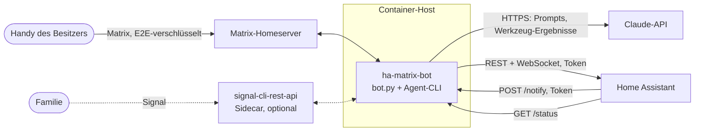
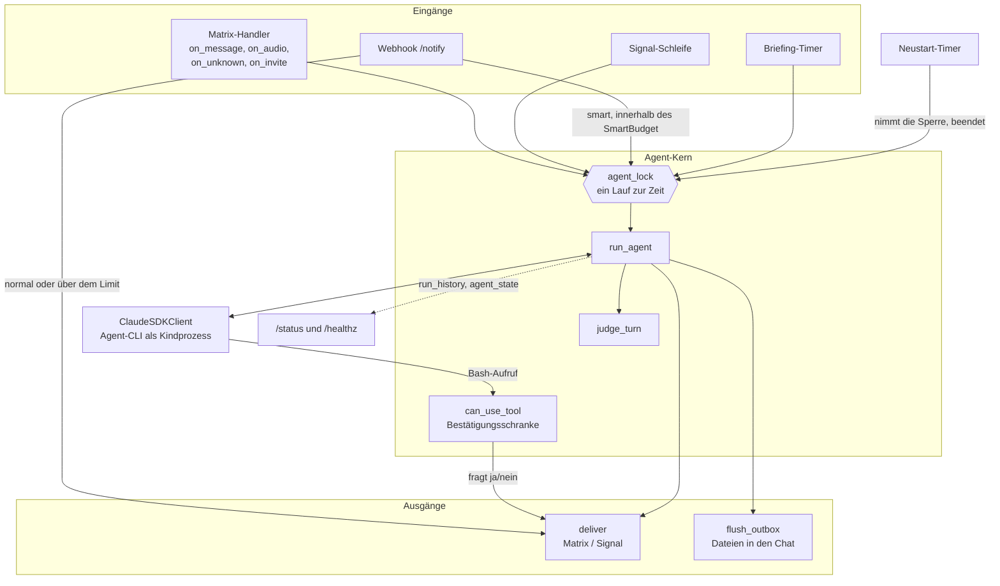
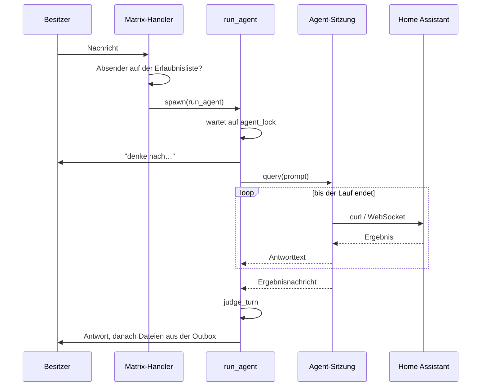
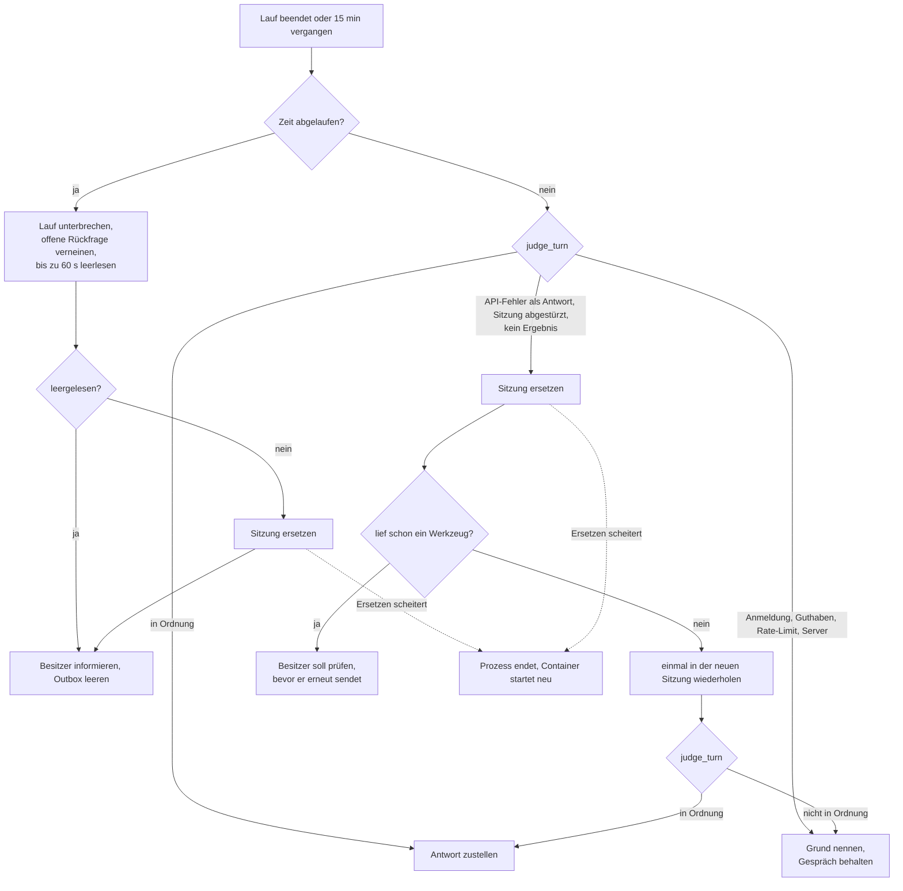
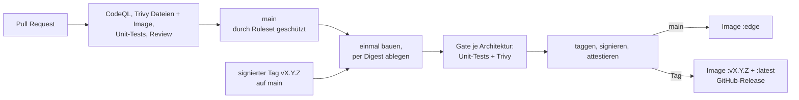

# Architektur

🇬🇧 [English version](architecture.md)

Wie der Bot aufgebaut ist, warum, und wo seine Grenzen liegen. Zur Einrichtung siehe das
[README](../README.de.md), zum Bedrohungsmodell [SECURITY.md](../SECURITY.md).

## 1. Was es ist

Ein einzelner Python-Prozess (`bot.py`, rund 1.400 Zeilen), der einen Chatraum mit einem
KI-Agenten verbindet:

- Auf der einen Seite ist er ein **Matrix-Client** (optional zusätzlich ein Signal-Client),
  der auf Nachrichten von einer Erlaubnisliste von Personen hört.
- Auf der anderen Seite hält er **eine dauerhaft offene Sitzung des Claude Agent SDK**. Der
  Agent hat eine Shell und Datei-Werkzeuge und bedient Home Assistant über dessen HTTP- und
  WebSocket-API.

Es gibt keine Datenbank und kein Web-Framework. Der Zustand besteht aus wenigen Dateien auf
zwei eingehängten Volumes und dem, was der Prozess im Speicher hält.

## 2. Systemkontext



Alle Verbindungen außer dem Webhook gehen nach außen. Der Port für Webhook und Status
(`8321`) ist optional und für das lokale Netz gedacht.

| Gegenstelle | Richtung | Protokoll | Anmeldung |
| --- | --- | --- | --- |
| Matrix-Homeserver | ausgehend | HTTPS, Long-Poll-Sync | Bot-Konto, gespeichertes Sitzungstoken |
| Claude-API | ausgehend | HTTPS (über die mitgelieferte Agent-CLI) | OAuth-Token oder API-Schlüssel |
| Home Assistant | ausgehend | REST und WebSocket | langlebiges Zugriffstoken |
| Signal-Sidecar | ausgehend | HTTP + WebSocket | keine (privates Container-Netz) |
| Home Assistant → Bot | eingehend | HTTP `/notify`, `/status` | gemeinsames Token (`X-Token`) |
| Container-Laufzeit → Bot | eingehend | HTTP `/healthz` | keine, verrät nur ok/degraded |

## 3. Im Prozess

Alles läuft auf einer asyncio-Ereignisschleife. `main()` verdrahtet die Teile als Closures
über gemeinsamem Zustand; die reine Entscheidungslogik liegt in Funktionen auf Modulebene,
damit sie testbar ist.



| Teil | Wo | Aufgabe |
| --- | --- | --- |
| Matrix-Client | `matrix-nio`, Handler `on_*` | Sync-Schleife, E2E-Verschlüsselung, Erlaubnisliste, Einladungen |
| Signal-Kanal | `signal_loop`, `handle_signal_envelope` | optionale zweite Chat-Oberfläche über den Sidecar |
| Agent-Sitzung | `ClaudeSDKClient`, `run_agent` | ein dauerhaftes Gespräch; das SDK startet seine CLI als Kindprozess |
| Lauf-Bewertung | `judge_turn` | entscheidet, ob man einem beendeten Lauf trauen kann |
| Bestätigungsschranke | `can_use_tool`, `ask_confirmation` | fragt den Besitzer vor einem destruktiven Shell-Befehl |
| Webhook und Status | `aiohttp`-App, `handle_notify`, `handle_status`, `handle_health` | Benachrichtigungen hinein, Status hinaus |
| Benachrichtigungs-Budget | `SmartBudget`, `parse_notify` | prüft Webhook-Körper, begrenzt die ausgelösten Agent-Läufe |
| Sprache | `faster-whisper` im Thread-Executor | lokale Transkription von Sprachnachrichten |
| Outbox | `flush_outbox` | lädt Dateien hoch, die der Agent in `$OUTBOX` abgelegt hat |
| Timer | `briefing_loop`, `wait_for_restart` | tägliches Briefing, geplanter Neustart |
| Hintergrund-Tasks | `spawn` | hält Referenzen auf Tasks, auf die niemand wartet |

## 4. Wichtige Abläufe

### 4.1 Eine Chat-Nachricht



Eine Sprachnachricht nimmt nach der lokalen Transkription denselben Weg. Eine Antwort oder
eine 👍/👎-Reaktion, die während einer offenen Rückfrage eintrifft, beantwortet diese
Rückfrage und startet keinen neuen Lauf.

### 4.2 Destruktive Befehle

Mit `CONFIRM_DESTRUCTIVE=true` (Standard) ist `Bash` nicht vorab freigegeben, jeder
Shell-Befehl läuft also durch `can_use_tool`. Befehle, auf die `DESTRUCTIVE_RE` passt (`rm`,
`kill`, HTTP `DELETE`, Neustart/Stopp von Home Assistant, Löschen von Backups, …), warten,
bis der Besitzer im Chat mit ja oder nein antwortet oder 180 Sekunden vergangen sind (dann
wird der Befehl abgelehnt). Alles andere wird sofort erlaubt.

`Read`, `Write`, `Edit`, `WebFetch` und `WebSearch` sind vorab freigegeben und erreichen
diese Schranke nie.

### 4.3 Wenn ein Lauf schiefgeht



Der Zweck von `judge_turn`: Ein Lauf kann `success` melden und trotzdem ein API-Fehler sein,
der wie eine Antwort aussieht. Die Funktion wertet die Signale des SDK aus (Fehlercodes an
den Antwortnachrichten, `is_error` am Ergebnis, den Ergebnis-Subtyp, ein fehlendes Ergebnis),
nicht die Laufzeit.

### 4.4 Benachrichtigungen aus Home Assistant

`POST /notify` mit `{"message": …, "smart": true|false, "room": …}`.

- Das Token wird zeitkonstant verglichen. Falsche Tokens werden geloggt, höchstens einmal
  pro Minute.
- Der Körper muss ein JSON-Objekt sein; `room`, falls angegeben, muss ein Raum sein, in dem
  der Bot Mitglied ist.
- `smart: false` stellt die Nachricht unverändert zu.
- `smart: true` startet einen Agent-Lauf, aber nur im Rahmen des Budgets: höchstens
  `NOTIFY_SMART_LIMIT` Läufe pro 10 Minuten und höchstens einer, der auf den Agenten wartet.
  Darüber wird die Nachricht trotzdem zugestellt, unverändert. Es geht nichts verloren.

### 4.5 Start, Neustart, Beenden

- **Start:** Konfiguration lesen, Geheimnisse des Bots aus der Umgebung entfernen,
  Agent-Sitzung verbinden, Matrix-Anmeldung wiederherstellen oder neu anlegen, Webhook, Timer
  und Sync starten.
- **Nach dem ersten Sync** meldet der Bot „wieder online" samt Version, außer dieser Start
  folgt auf den geplanten Neustart oder die letzte solche Meldung ist jünger als 10 Minuten.
- **Geplanter Neustart** (`RESTART_TIME`, Standard 03:00): Der Timer wartet einen laufenden
  Lauf ab, vermerkt den Neustart als geplant in der Zustandsdatei und lässt `main()`
  zurückkehren. Die Restart-Policy des Containers startet einen frischen Prozess und damit
  ein frisches Gespräch.
- **Nicht wiederherstellbare Agent-Sitzung:** Der Prozess endet mit Status 1, der Weg zurück
  ist derselbe.

## 5. Nebenläufigkeit

- **Ein Agent-Lauf zur Zeit.** `agent_lock` reiht jeden Prompt ein, gleich aus welcher
  Quelle, damit sich die Läufe des einen Gesprächs nicht überlagern.
- **Handler blockieren die Sync-Schleife nie.** Sie starten Läufe über `spawn`, das zugleich
  eine Referenz auf den Task hält, bis er fertig ist (asyncio selbst hält nur schwache
  Referenzen).
- **Blockierende Arbeit verlässt die Schleife.** Die Whisper-Transkription läuft im
  Thread-Executor.
- **Fristen:** Ein Lauf wird nach `AGENT_TIMEOUT_S` (900 s) abgebrochen, eine Rückfrage nach
  180 s, das Leerlesen eines unterbrochenen Laufs nach 60 s. Ein Wiederholungsversuch teilt
  sich das Zeitbudget mit dem ersten Versuch.

## 6. Zustand

| Was | Wo | Lebensdauer |
| --- | --- | --- |
| Matrix-Geräteidentität, E2E-Schlüssel | Volume `store/` | dauerhaft; Verlust bedeutet ein neues Gerät |
| Matrix-Sitzungstoken | `data/matrix_session.json` | bis der Server es ablehnt |
| Letzter Raum, Merker für geplanten Neustart, letzte Online-Meldung | `data/state.json` | dauerhaft |
| Notizen des Agenten | `data/memory.md` (vom Agenten geschrieben) | dauerhaft |
| Cache des Whisper-Modells | `data/hf/` | dauerhaft, neu herunterladbar |
| Dateien für den Chat | `/app/outbox` | bis zum nächsten Leeren |
| Gespräch mit dem Agenten | Agent-Sitzung, im Speicher | bis zum Neustart oder Ersetzen der Sitzung |
| Lauf-Historie (20), Agent-Zustand, Log-Ringpuffer (200 Zeilen) | im Speicher | bis zum Neustart |
| Budget für smarte Benachrichtigungen, Drossel für Token-Warnungen | im Speicher | bis zum Neustart |

## 7. Sicherheitsarchitektur

Das vollständige Bedrohungsmodell steht in [SECURITY.md](../SECURITY.md). Die
Strukturentscheidungen:

- **Wer mit ihm sprechen darf:** eine Erlaubnisliste von Matrix-IDs (und Signal-Nummern),
  geprüft bei jedem Ereignis, jeder Einladung und jeder Reaktion. Alles andere wird ignoriert.
- **Was der Agent tun darf:** Shell- und Datei-Werkzeuge ohne Freigabe je Aktion, mit
  Ausnahme der Bestätigungsschranke für destruktive Shell-Befehle.
- **Was der Agent lesen kann:** Er braucht `HA_TOKEN` und das Claude-Token, die bleiben also
  in seiner Umgebung. `MATRIX_PASSWORD` und `WEBHOOK_TOKEN` werden vor dem Start der Sitzung
  aus der Umgebung entfernt, und der Prozess ist als nicht dumpbar markiert, damit sie nicht
  über `/proc` zurückgelesen werden können. Der Agent läuft als derselbe Benutzer wie der Bot
  und kann `data/` und `store/` weiterhin lesen.
- **Nicht vertrauenswürdige Eingaben:** Alles, was der Agent liest (Webseiten, Daten aus Home
  Assistant, Webhook-Texte, transkribiertes Audio), kann versuchen, ihn zu steuern. Die
  Erlaubnisliste schützt davor nicht.
- **Container:** unprivilegierter Benutzer, kein Compiler, kein pip, Abhängigkeiten aus einem
  Lockfile mit Hashes installiert.

## 8. Konfiguration

Die gesamte Konfiguration erfolgt über Umgebungsvariablen; `.env.example` beschreibt jede.

| Gruppe | Variablen |
| --- | --- |
| Pflicht | `CLAUDE_CODE_OAUTH_TOKEN` oder `ANTHROPIC_API_KEY`, `HA_BASE_URL`, `HA_TOKEN`, `MATRIX_HOMESERVER`, `MATRIX_USER`, `MATRIX_PASSWORD`, `MATRIX_ALLOWED_USERS` |
| Verhalten | `BOT_LANG`, `TZ`, `CLAUDE_MODEL`, `CONFIRM_DESTRUCTIVE`, `AGENT_TIMEOUT_S`, `RESTART_TIME` |
| Webhook | `WEBHOOK_PORT`, `WEBHOOK_TOKEN`, `NOTIFY_ROOM`, `NOTIFY_SMART_LIMIT` |
| Funktionen | `BRIEFING_TIME`, `WHISPER_MODEL` |
| Signal | `SIGNAL_API_URL`, `SIGNAL_NUMBER`, `SIGNAL_ALLOWED_NUMBERS`, `SIGNAL_NOTIFY` |

## 9. Build und Release



- **`main`** ändert sich nur über Pull Requests mit grünen Checks und signierten Commits.
- **Das Image wird einmal gebaut** und per Digest abgelegt. Dieser Digest wird auf amd64 und
  arm64 getestet und gescannt; erst danach bekommt er einen Tag, eine Sigstore-Signatur und
  einen Herkunftsnachweis. Veröffentlicht wird, was geprüft wurde.
- **Ein Release** braucht einen annotierten Tag, dessen Signatur GitHub verifiziert hat, auf
  einem Commit von `main`. Release-Tags lassen sich weder verschieben noch löschen.
- **Die Version** stammt aus `git describe` und ist ins Image eingebaut; der Bot zeigt sie im
  Start-Log, auf `/status` und in der Online-Meldung.
- **Abhängigkeiten** stehen in `pyproject.toml`; `uv.lock` legt alle mit Hashes fest.
  Dependabot hält Lockfile, Basis-Images und GitHub Actions aktuell.

## 10. Betrieb

Ein Container, eine Instanz. Eine zweite Instanz würde um dasselbe Matrix-Gerät streiten und
das Gespräch aufspalten.

- **Docker Compose:** `docker-compose.yml`, zwei eingehängte Ordner (`store/`, `data/`),
  `restart: unless-stopped`. Der geplante Neustart verlässt sich auf diese Policy.
- **Kubernetes:** einfache Manifeste in `deploy/k8s/` und ein Helm-Chart in `deploy/helm/`,
  mit zwei Volumes und `/healthz` als Liveness-Probe.

`/healthz` meldet nur, ob die Matrix-Sync-Schleife lebt. Den Zustand des Agenten spiegelt es
bewusst nicht wider, damit ein API-Ausfall keinen Pod in eine Neustart-Schleife schickt. Der
Zustand des Agenten steht auf `/status` (`agent_ok`, `agent_failure`).

## 11. Tests

`tests/` enthält Unit-Tests (`unittest` aus der Standardbibliothek) für die
Entscheidungsfunktionen auf Modulebene: `parse_notify`, `SmartBudget`, `judge_turn` und
`should_announce_start`. Sie laufen im gebauten Image, dem einzigen Ort mit den
Abhängigkeiten des Bots:

```bash
docker run --rm -v "$PWD/bot.py:/work/bot.py:ro" -v "$PWD/tests:/work/tests:ro" \
  -w /work --entrypoint python <image> -m unittest discover -s tests -v
```

## 12. Bekannte Grenzen

- **`main()` ist eine einzige große Funktion.** Die Handler sind Closures darin und haben
  keine Tests; nur die herausgezogenen Entscheidungsfunktionen haben welche. Timeout-
  Behandlung, Ersetzen der Sitzung und die Verdrahtung des Webhooks sind in der CI nie gegen
  eine echte SDK-Sitzung gelaufen.
- **Die Bestätigungsschranke gilt nur für `Bash`.** Die anderen Werkzeuge sind vorab
  freigegeben, und mit `CONFIRM_DESTRUCTIVE=false` gibt es gar keine Schranke.
- **Der Agent teilt sich den Benutzer mit dem Bot.** Er kann das Matrix-Sitzungstoken und die
  E2E-Schlüssel auf den Volumes lesen. Das zu trennen braucht einen zweiten Benutzer für den
  Agent-Prozess.
- **Ein Gespräch, im Speicher.** Es geht bei jedem Neustart verloren, auch beim nächtlichen;
  nur `memory.md` bleibt erhalten.
- **Zähler beginnen nach einem Neustart neu:** Lauf-Historie, Benachrichtigungs-Budget,
  Agent-Zustand.
- **Keine Größengrenze für Sprachnachrichten.** Sie werden vollständig in den Speicher
  gelesen.
