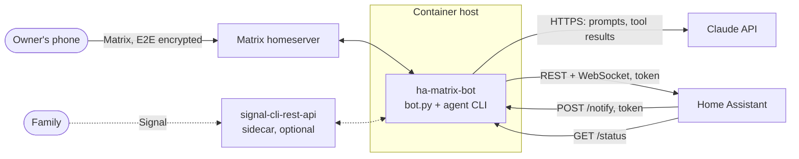
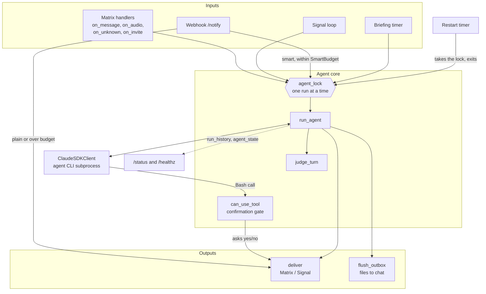
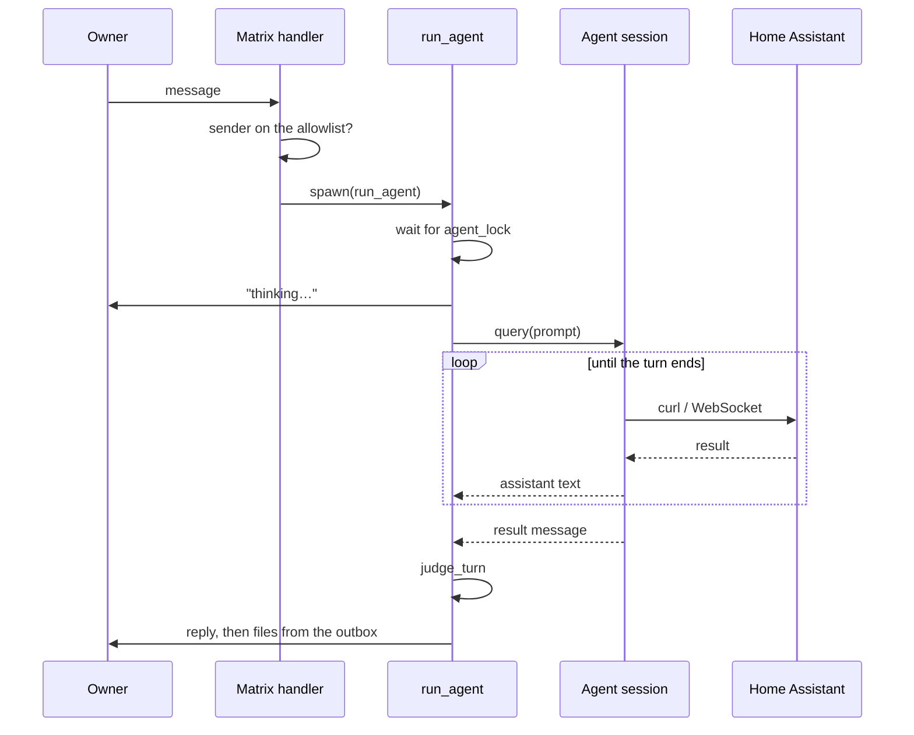
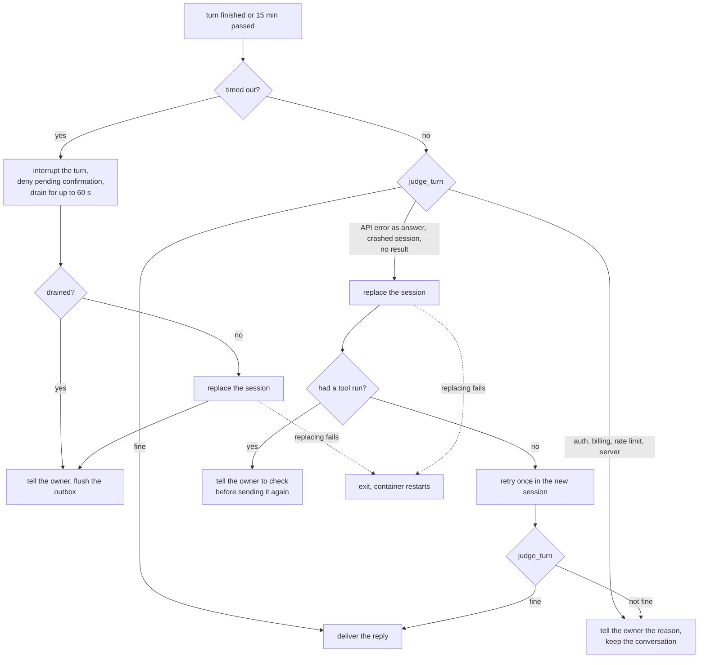
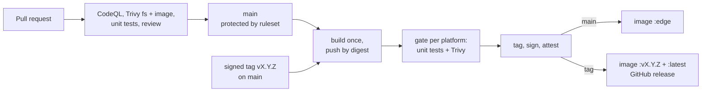

# Architecture

🇩🇪 [Deutsche Version](architecture.de.md)

How the bot is put together, why, and where its limits are. For setup see the
[README](../README.md), for the threat model [SECURITY.md](../SECURITY.md).

## 1. What it is

One Python process (`bot.py`, about 1,400 lines) that bridges a chat room to an AI agent:

- On one side it is a **Matrix client** (optionally also a Signal client) that listens for
  messages from an allowlist of people.
- On the other side it holds **one long-lived Claude Agent SDK session**. The agent has a
  shell and file tools and operates Home Assistant through its HTTP and WebSocket API.

There is no database and no web framework. State is a handful of files on two mounted
volumes plus what the process keeps in memory.

## 2. System context



All connections except the webhook are outbound. The webhook and status port (`8321`) is
optional and meant for the local network.

| Peer | Direction | Protocol | Authentication |
| --- | --- | --- | --- |
| Matrix homeserver | outbound | HTTPS long-poll sync | bot account, stored session token |
| Claude API | outbound | HTTPS (via the bundled agent CLI) | OAuth token or API key |
| Home Assistant | outbound | REST and WebSocket | long-lived access token |
| Signal sidecar | outbound | HTTP + WebSocket | none (private container network) |
| Home Assistant → bot | inbound | HTTP `/notify`, `/status` | shared token (`X-Token`) |
| Container runtime → bot | inbound | HTTP `/healthz` | none, reveals only ok/degraded |

## 3. Inside the process

Everything runs on one asyncio event loop. `main()` wires the parts together as closures over
shared state; the pure decision logic lives in module-level functions so it can be tested.



| Part | Where | Role |
| --- | --- | --- |
| Matrix client | `matrix-nio`, handlers `on_*` | sync loop, E2E encryption, allowlist check, invites |
| Signal channel | `signal_loop`, `handle_signal_envelope` | optional second chat surface via the sidecar |
| Agent session | `ClaudeSDKClient`, `run_agent` | one persistent conversation; the SDK starts its CLI as a child process |
| Turn judgement | `judge_turn` | decides whether a finished turn can be trusted |
| Confirmation gate | `can_use_tool`, `ask_confirmation` | asks the owner before a destructive shell command |
| Webhook and status | `aiohttp` app, `handle_notify`, `handle_status`, `handle_health` | notifications in, status out |
| Notification budget | `SmartBudget`, `parse_notify` | validates webhook bodies, caps agent runs they trigger |
| Voice | `faster-whisper` in a thread executor | local transcription of voice messages |
| Outbox | `flush_outbox` | uploads files the agent saved to `$OUTBOX` |
| Timers | `briefing_loop`, `wait_for_restart` | daily briefing, scheduled restart |
| Background tasks | `spawn` | keeps references to fire-and-forget tasks |

## 4. Key flows

### 4.1 A chat message



A voice message takes the same path after local transcription. A reply or a 👍/👎 reaction
that arrives while a confirmation is pending answers that confirmation instead of starting a
new run.

### 4.2 Destructive commands

With `CONFIRM_DESTRUCTIVE=true` (default) `Bash` is not pre-approved, so every shell command
passes `can_use_tool`. Commands matching `DESTRUCTIVE_RE` (`rm`, `kill`, HTTP `DELETE`,
Home Assistant restart/stop, backup deletion, …) are held until the owner answers yes or no
in the chat, or 180 seconds pass (then the command is denied). Everything else is allowed
at once.

`Read`, `Write`, `Edit`, `WebFetch` and `WebSearch` are pre-approved and never reach this
gate.

### 4.3 When a run goes wrong



The point of `judge_turn`: a turn can report `success` and still be an API error dressed up as
an answer. It looks at the SDK's own signals (error codes on assistant messages, `is_error`
on the result, the result subtype, a missing result), not at timing.

### 4.4 Notifications from Home Assistant

`POST /notify` with `{"message": …, "smart": true|false, "room": …}`.

- The token is compared in constant time. Bad tokens are logged, at most once a minute.
- The body must be a JSON object; `room`, if given, must be a room the bot has joined.
- `smart: false` posts the message verbatim.
- `smart: true` starts an agent run, but only while the budget allows: at most
  `NOTIFY_SMART_LIMIT` runs per 10 minutes and at most one waiting for the agent. Beyond
  that the message is still delivered, verbatim. Nothing is dropped.

### 4.5 Start, restart, shutdown

- **Start:** read the configuration, remove bot-only secrets from the environment, connect
  the agent session, restore or create the Matrix login, start webhook, timers and sync.
- **After the first sync** the bot posts "back online" with its version, unless this start
  follows the scheduled restart or the last such message is less than 10 minutes old.
- **Scheduled restart** (`RESTART_TIME`, default 03:00): the timer waits for a running turn,
  marks the restart as planned in the state file and lets `main()` return. The container's
  restart policy starts a fresh process, and with it a fresh agent conversation.
- **Unrecoverable agent session:** the process exits with status 1, same recovery path.

## 5. Concurrency

- **One agent run at a time.** `agent_lock` serialises every prompt, whatever its source, so
  turns of the one conversation cannot interleave.
- **Handlers never block the sync loop.** They start runs through `spawn`, which also holds a
  reference to the task until it is done (asyncio itself only keeps weak references).
- **Blocking work leaves the loop.** Whisper transcription runs in a thread executor.
- **Deadlines:** a run is cancelled after `AGENT_TIMEOUT_S` (900 s), a confirmation after
  180 s, draining an interrupted turn after 60 s. A retry shares the first attempt's budget.

## 6. State

| What | Where | Lifetime |
| --- | --- | --- |
| Matrix device identity, E2E keys | `store/` volume | permanent; losing it means a new device |
| Matrix session token | `data/matrix_session.json` | until the server rejects it |
| Last room, planned-restart flag, last online notice | `data/state.json` | permanent |
| Agent's notes | `data/memory.md` (written by the agent) | permanent |
| Whisper model cache | `data/hf/` | permanent, can be re-downloaded |
| Files for the chat | `/app/outbox` | until the next flush |
| Conversation with the agent | agent session, in memory | until restart or session replacement |
| Run history (20), agent state, log ring buffer (200 lines) | in memory | until restart |
| Smart-notification budget, bad-token log throttle | in memory | until restart |

## 7. Security architecture

The full threat model is in [SECURITY.md](../SECURITY.md). The structural decisions:

- **Who may talk to it:** a Matrix-ID allowlist (and Signal numbers), checked on every event,
  invite and reaction. Everything else is ignored.
- **What the agent may do:** shell and file tools without per-action approval, except the
  confirmation gate for destructive shell commands.
- **What the agent can read:** it needs `HA_TOKEN` and the Claude credential, so those stay
  in its environment. `MATRIX_PASSWORD` and `WEBHOOK_TOKEN` are removed from the environment
  before the session starts, and the process is marked non-dumpable so they cannot be read
  back from `/proc`. The agent runs as the same user as the bot and can still read `data/`
  and `store/`.
- **Untrusted input:** everything the agent reads (web pages, Home Assistant data, webhook
  text, transcribed audio) can try to steer it. The allowlist does not protect against that.
- **Container:** unprivileged user, no compiler, no pip, dependencies installed from a
  hash-pinned lockfile.

## 8. Configuration

All configuration is environment variables; `.env.example` documents each one.

| Group | Variables |
| --- | --- |
| Required | `CLAUDE_CODE_OAUTH_TOKEN` or `ANTHROPIC_API_KEY`, `HA_BASE_URL`, `HA_TOKEN`, `MATRIX_HOMESERVER`, `MATRIX_USER`, `MATRIX_PASSWORD`, `MATRIX_ALLOWED_USERS` |
| Behaviour | `BOT_LANG`, `TZ`, `CLAUDE_MODEL`, `CONFIRM_DESTRUCTIVE`, `AGENT_TIMEOUT_S`, `RESTART_TIME` |
| Webhook | `WEBHOOK_PORT`, `WEBHOOK_TOKEN`, `NOTIFY_ROOM`, `NOTIFY_SMART_LIMIT` |
| Features | `BRIEFING_TIME`, `WHISPER_MODEL` |
| Signal | `SIGNAL_API_URL`, `SIGNAL_NUMBER`, `SIGNAL_ALLOWED_NUMBERS`, `SIGNAL_NOTIFY` |

## 9. Build and release



- **`main`** only changes through pull requests with green checks and signed commits.
- **The image is built once** and pushed by digest. That digest is tested and scanned on
  amd64 and arm64; only then does it get a tag, a Sigstore signature and a provenance
  attestation. What is published is what was checked.
- **A release** needs an annotated tag whose signature GitHub has verified, on a commit of
  `main`. Release tags cannot be moved or deleted.
- **The version** comes from `git describe` and is baked into the image; the bot shows it in
  the startup log, on `/status` and in the "back online" message.
- **Dependencies** live in `pyproject.toml`; `uv.lock` pins all of them with hashes.
  Dependabot keeps the lockfile, the base images and the GitHub Actions current.

## 10. Deployment

One container, one replica. A second instance would fight over the same Matrix device and
split the conversation.

- **Docker Compose:** `docker-compose.yml`, two bind mounts (`store/`, `data/`),
  `restart: unless-stopped`. The scheduled restart relies on that policy.
- **Kubernetes:** plain manifests in `deploy/k8s/` and a Helm chart in `deploy/helm/`, with
  two volumes and `/healthz` as liveness probe.

`/healthz` reports only whether the Matrix sync loop is alive. It deliberately does not
reflect the agent's state, so an API outage cannot put a pod into a restart loop. The
agent's state is on `/status` (`agent_ok`, `agent_failure`).

## 11. Tests

`tests/` holds unit tests (stdlib `unittest`) for the module-level decision functions:
`parse_notify`, `SmartBudget`, `judge_turn` and `should_announce_start`. They run inside the
built image, the only place that has the bot's dependencies:

```bash
docker run --rm -v "$PWD/bot.py:/work/bot.py:ro" -v "$PWD/tests:/work/tests:ro" \
  -w /work --entrypoint python <image> -m unittest discover -s tests -v
```

## 12. Known limits

- **`main()` is one large function.** The handlers are closures inside it and have no tests;
  only the extracted decision functions do. Timeout handling, session replacement and the
  webhook wiring have not been exercised against a live SDK session in CI.
- **The confirmation gate covers `Bash` only.** The other tools are pre-approved, and with
  `CONFIRM_DESTRUCTIVE=false` there is no gate at all.
- **The agent shares the bot's user.** It can read the Matrix session token and the E2E keys
  on the volumes. Separating them needs a second user for the agent process.
- **One conversation, in memory.** It is lost on every restart, including the nightly one;
  only `memory.md` carries over.
- **Counters reset on restart:** run history, notification budget, agent state.
- **No size limit on voice messages.** They are read into memory completely.
